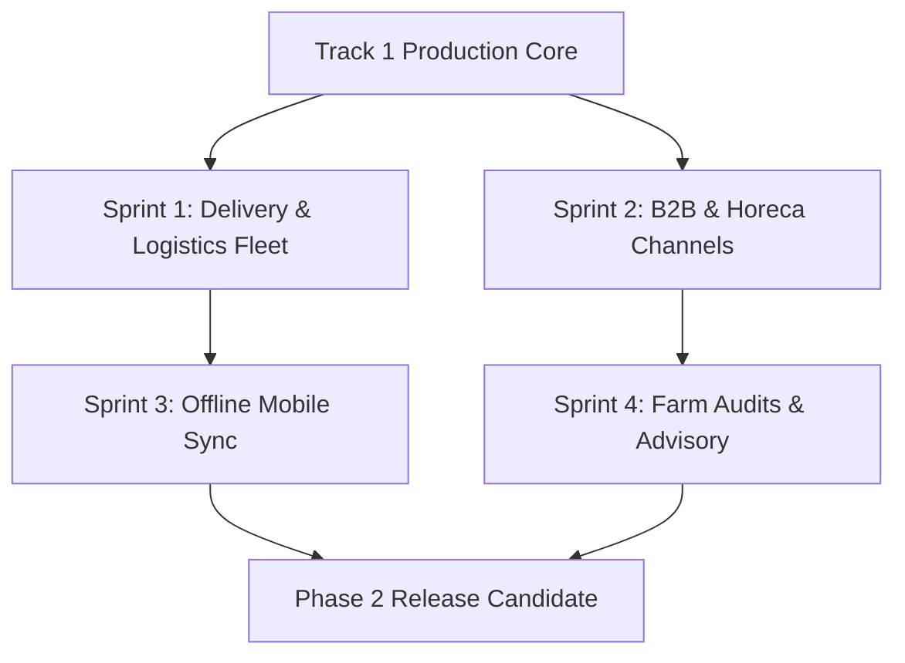

# TOHFA Phase-2 Engineering Roadmap

**Story Reference:** S-53  
**Target Execution Window:** Post-Launch Track 1 Handover  
**Estimated Total Sizing:** 80 Developer Days (4 x 2-week sprints for a 2-developer squad)

---

## 1. Roadmap Architecture & Sequence

---

## 2. Sequenced Work Packages (Epics)

### Sprint 1: Doorstep Delivery & 3PL Logistics Integration
- **Duration:** 20 Developer Days
- **Prerequisite Dependencies:** Resolution of Contradiction 3; 3PL Aggregator API credentials (Shadowfax / Dunzo).
- **Deliverables:**
  1. Delivery slot selection engine on customer checkout (`apps/customer-mobile/src/screens/CheckoutScreen.tsx`).
  2. Warehouse dispatch & 3PL courier manifest generation API (`/v1/orders/{id}/dispatch`).
  3. Real-time courier webhook tracking and live SSE driver status stream.
  4. Doorstep delivery confirmation with customer-held OTP verification.

---

### Sprint 2: B2B & Horeca Wholesale Sales Channels
- **Duration:** 18 Developer Days
- **Prerequisite Dependencies:** Resolution of Contradiction 10; B2B Tax / GST registration schema.
- **Deliverables:**
  1. Bulk wholesale pricing tiers and minimum order quantity (MOQ) engine (`/v1/catalog/b2b`).
  2. B2B credit ledger with 30-day payment term tracking.
  3. Automated inventory allocation split for Horeca / B2B buckets (`allocations.service.ts`).
  4. Enterprise PDF tax invoices with B2B GSTIN compliance.

---

### Sprint 3: Offline-First Mobile Resilience
- **Duration:** 14 Developer Days
- **Prerequisite Dependencies:** WatermelonDB / SQLite local schema migration in `farmer-mobile`.
- **Deliverables:**
  1. SQLite local persistence for farmer produce draft listings and crop photos.
  2. Background synchronization worker with exponential backoff and conflict resolution.
  3. Resumable chunked Azure Blob media upload retry queue.
  4. Network state banner and offline-mode UX indicators.

---

### Sprint 4: Farm Audits, Dynamic Scoring & Agronomic Advisory
- **Duration:** 16 Developer Days
- **Prerequisite Dependencies:** Resolution of Contradictions 1 & 2; IMD Weather API integration.
- **Deliverables:**
  1. 10-category farm inspection checklist and scoring computation engine (`/v1/audits`).
  2. Automated farmer tier assignment (`<650`, `650-700`, `700-749`, `750+`).
  3. Regional weather risk alerts and automated crop protection advisory notices.
  4. Automated certificate renewal reminders and expiry-block notifications.

---

### Sprint 5: Hardening, Security Audit & Phase-2 Release
- **Duration:** 12 Developer Days
- **Prerequisite Dependencies:** Sprints 1–4 completion.
- **Deliverables:**
  1. End-to-end golden-thread testing across B2B, Delivery, and Audits.
  2. External penetration testing and vulnerability mitigation.
  3. Production load testing for 50,000 daily active mobile sessions.
  4. Store version update deployment to Google Play & Apple App Store.

---

## 3. Risk & Dependency Matrix

| Risk Factor | Probability | Impact | Mitigation Strategy |
| :--- | :--- | :--- | :--- |
| **Delay in Contradiction Resolutions** | Medium | High | Engineering team works on Sprint 1 (Logistics) which has clear 3PL integration boundaries while client committee resolves Contradictions 1 & 2. |
| **3PL Courier API Outages** | Low | High | Fallback automatically to warehouse pickup mode when 3PL API is unreachable. |
| **Offline Sync Data Conflicts** | Medium | Medium | Server-authoritative timestamping (`updated_at` optimistic locking) prevents overwriting concurrently modified listings. |
